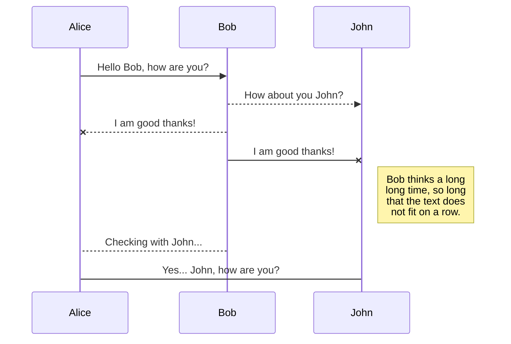
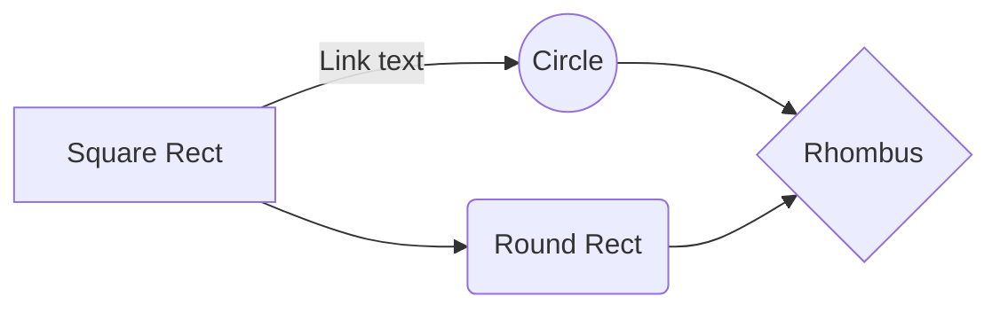

# Welcome to StackEdit!

Hi! I'm your first Markdown file in **StackEdit**. If you want to learn about StackEdit, you can read me. If you want to play with Markdown, you can edit me. Once you have finished with me, you can create new files by opening the **file explorer** on the left corner of the navigation bar.


# Files

StackEdit stores your files in your browser, which means all your files are automatically saved locally and are accessible **offline!**

## Create files and folders

The file explorer is accessible using the button in left corner of the navigation bar. You can create a new file by clicking the **New file** button in the file explorer. You can also create folders by clicking the **New folder** button.

## Switch to another file

All your files and folders are presented as a tree in the file explorer. You can switch from one to another by clicking a file in the tree.

## Rename a file

You can rename the current file by clicking the file name in the navigation bar or by clicking the **Rename** button in the file explorer.

## Delete a file

You can delete the current file by clicking the **Remove** button in the file explorer. The file will be moved into the **Trash** folder and automatically deleted after 7 days of inactivity.

## Export a file

You can export the current file by clicking **Export to disk** in the menu. You can choose to export the file as plain Markdown, as HTML using a Handlebars template or as a PDF.


# Synchronization

Synchronization is one of the biggest features of StackEdit. It enables you to synchronize any file in your workspace with other files stored in your **Google Drive**, your **Dropbox** and your **GitHub** accounts. This allows you to keep writing on other devices, collaborate with people you share the file with, integrate easily into your workflow... The synchronization mechanism takes place every minute in the background, downloading, merging, and uploading file modifications.

There are two types of synchronization and they can complement each other:

- The workspace synchronization will sync all your files, folders and settings automatically. This will allow you to fetch your workspace on any other device.
	> To start syncing your workspace, just sign in with Google in the menu.

- The file synchronization will keep one file of the workspace synced with one or multiple files in **Google Drive**, **Dropbox** or **GitHub**.
	> Before starting to sync files, you must link an account in the **Synchronize** sub-menu.

## Open a file

You can open a file from **Google Drive**, **Dropbox** or **GitHub** by opening the **Synchronize** sub-menu and clicking **Open from**. Once opened in the workspace, any modification in the file will be automatically synced.

## Save a file

You can save any file of the workspace to **Google Drive**, **Dropbox** or **GitHub** by opening the **Synchronize** sub-menu and clicking **Save on**. Even if a file in the workspace is already synced, you can save it to another location. StackEdit can sync one file with multiple locations and accounts.

## Synchronize a file

Once your file is linked to a synchronized location, StackEdit will periodically synchronize it by downloading/uploading any modification. A merge will be performed if necessary and conflicts will be resolved.

If you just have modified your file and you want to force syncing, click the **Synchronize now** button in the navigation bar.

> **Note:** The **Synchronize now** button is disabled if you have no file to synchronize.

## Manage file synchronization

Since one file can be synced with multiple locations, you can list and manage synchronized locations by clicking **File synchronization** in the **Synchronize** sub-menu. This allows you to list and remove synchronized locations that are linked to your file.


# Publication

Publishing in StackEdit makes it simple for you to publish online your files. Once you're happy with a file, you can publish it to different hosting platforms like **Blogger**, **Dropbox**, **Gist**, **GitHub**, **Google Drive**, **WordPress** and **Zendesk**. With [Handlebars templates](http://handlebarsjs.com/), you have full control over what you export.

> Before starting to publish, you must link an account in the **Publish** sub-menu.

## Publish a File

You can publish your file by opening the **Publish** sub-menu and by clicking **Publish to**. For some locations, you can choose between the following formats:

- Markdown: publish the Markdown text on a website that can interpret it (**GitHub** for instance),
- HTML: publish the file converted to HTML via a Handlebars template (on a blog for example).

## Update a publication

After publishing, StackEdit keeps your file linked to that publication which makes it easy for you to re-publish it. Once you have modified your file and you want to update your publication, click on the **Publish now** button in the navigation bar.

> **Note:** The **Publish now** button is disabled if your file has not been published yet.

## Manage file publication

Since one file can be published to multiple locations, you can list and manage publish locations by clicking **File publication** in the **Publish** sub-menu. This allows you to list and remove publication locations that are linked to your file.


# Markdown extensions

StackEdit extends the standard Markdown syntax by adding extra **Markdown extensions**, providing you with some nice features.

> **ProTip:** You can disable any **Markdown extension** in the **File properties** dialog.


## SmartyPants

SmartyPants converts ASCII punctuation characters into "smart" typographic punctuation HTML entities. For example:

|                |ASCII                          |HTML                         |
|----------------|-------------------------------|-----------------------------|
|Single backticks|`'Isn't this fun?'`            |'Isn't this fun?'            |
|Quotes          |`"Isn't this fun?"`            |"Isn't this fun?"            |
|Dashes          |`-- is en-dash, --- is em-dash`|-- is en-dash, --- is em-dash|


## KaTeX

You can render LaTeX mathematical expressions using [KaTeX](https://khan.github.io/KaTeX/):

The *Gamma function* satisfying $\Gamma(n) = (n-1)!\quad\forall n\in\mathbb N$ is via the Euler integral

$$
\Gamma(z) = \int_0^\infty t^{z-1}e^{-t}dt\,.
$$

> You can find more information about **LaTeX** mathematical expressions [here](http://meta.math.stackexchange.com/questions/5020/mathjax-basic-tutorial-and-quick-reference).


## UML diagrams

You can render UML diagrams using [Mermaid](https://mermaidjs.github.io/). For example, this will produce a sequence diagram:



And this will produce a flow chart:



# Using mprotect() at runtime to turn a non-executable stack into an executable stack  
  
* `man 2 mprotect` tells us: int mprotect(void addr[.len], size_t len, int prot);  
#######################EAX########EBX######ECX###EDX 
  
* GDB is a dynamic debugger which means we can pause a program, and, for example, modify the content of the registers with values we want to use, and run the program again.  
* We want to see if we can use mprotect() syscall in a program that doesnt originally include it in order to turn the stack into an executable one, and therefore, bypass the NX protection.  
  
  
## Plan:  
  
1. launch GDB on the program.  
2. create a breakpoint and run the program.  
3. get the stack base address.  
4. get mprotect() address, go there and change the values stored in the ECX, EBX and EDX registers.  
6. run the program until the syscall has been done.  
7. check if the stack has become executable.
  
  
## Details:  
  
* Launch GDB on vulnerable, create a breakpoint, run the program  
```bash  
gdb vulnerable  
...  
gef➤ b _start  
gef➤ r  
```  
  
* Use `vmmap` to get the stack base address  
```bash  
gef➤ vmmap  
...  
0xfffdd000 0xffffe000 0x00000000 rw- [stack]  
```  
  
* Disas mprotect to get its base address  
```bash  
gef➤ disas mprotect  
...  
0xf7e8f0d0 <+0>: push ebx		# mprotect() base address
```  
  
* Change EIP value so when the next instruction is executed using `si` we land straight into mprotect.  
```bash  
gef➤ set $eip=0xf7e8f0d0  
gef➤ si		# this should land you directly inside mprotect() if you have setup EIP properly
```  
  
* At this point we are inside mprotect. Keep using `si` until reaching the calling point  
```bash  
0xf7e8f0e2 <mprotect+0012> call DWORD PTR gs:0x10  # you should see something like this
```  
> Depending on what you use to compile your program, what appears can be different, so if doesnt look exactly the same, no panic. Do you see the instruction 'call' ? Yes ? Then you should be good.
  
* The next instruction will run the syscall, this means all the parameters are already on the stack, in their respective registers, ready to be 'consumed' when the syscall executes. 
* We know the first param will go into EBX,  the second in ECX and the last into EDX.   
--> EBX will contain the stack base address (the area we wanna apply our changes to): 0xf7e8f0e2  
--> ECX will contain the size. 
--> EDX will contain the 'rights' value: 7 for `rwx`

* In order to find the size we wanna use, lets make few calculations using GDB:  
```bash  
gef➤ vmmap  
...  
0xfffdd000 0xffffe000 0x00000000 rw- [stack]  
gef➤ x/x 0xffffe000-0xfffdd000  
0x21000: Cannot access memory at address 0x21000  
```
> This means we need a size of at least 0x21000 in order to be sure to cover the whole stack.
* Let's setup the registers:
```bash
gef➤ set $ebx=0xfffdd000
gef➤ set $ecx=0x21000
gef➤ set $edx=0x7
gef➤ si
```
* Use `si` unti you reach the ret instruction point: `0xf7fc757c <__kernel_vsyscall+000c> ret`
> again this could be differently represented, but the point is to reach the `ret` instruction in order to make sure the syscall has been *(close to fully)* executed.

* Check the stack it should now be executable
```bash
gef➤ vmmap  
...
0xf7d75000 0xf7d98000 0x00000000 r-- /usr/lib32/libc.so.6  
0xf7d98000 0xf7f16000 0x00023000 r-x  /usr/lib32/libc.so.6  
0xf7f16000 0xf7f9b000 0x001a1000 r-- /usr/lib32/libc.so.6  
0xf7f9b000 0xf7f9d000 0x00226000 r-- /usr/lib32/libc.so.6  
0xf7f9d000 0xf7f9e000 0x00228000 rw- /usr/lib32/libc.so.6  
0xf7f9e000 0xf7fa8000 0x00000000 rw-  
0xf7fc1000 0xf7fc3000 0x00000000 rw-  
0xf7fc3000 0xf7fc7000 0x00000000 r-- [vvar]  
0xf7fc7000 0xf7fc9000 0x00000000 r-x  [vdso]  
0xf7fc9000 0xf7fca000 0x00000000 r-- /usr/lib32/ld-linux.so.2  
0xf7fca000 0xf7fed000 0x00001000 r-x  /usr/lib32/ld-linux.so.2  
0xf7fed000 0xf7ffb000 0x00024000 r-- /usr/lib32/ld-linux.so.2  
0xf7ffb000 0xf7ffd000 0x00032000 r-- /usr/lib32/ld-linux.so.2  
0xf7ffd000 0xf7ffe000 0x00034000 rw- /usr/lib32/ld-linux.so.2  
0xfffdd000 0xffffe000 0x00000000 rwx  [stack]
```


